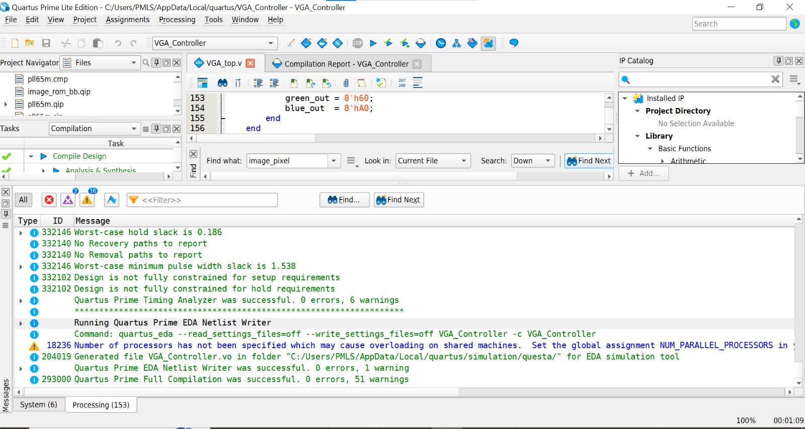
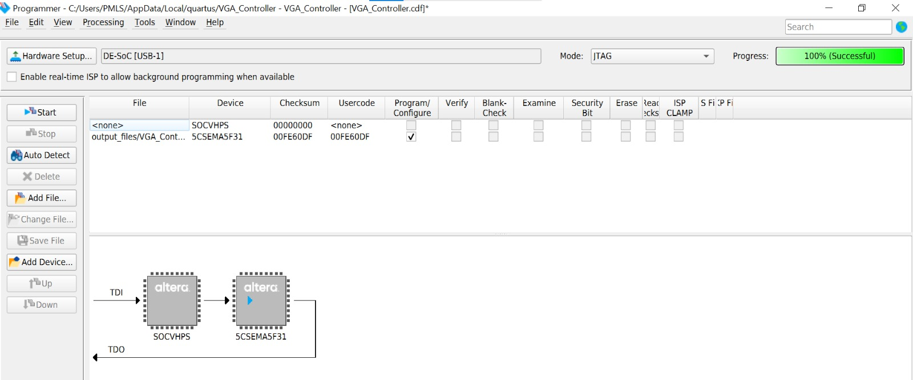
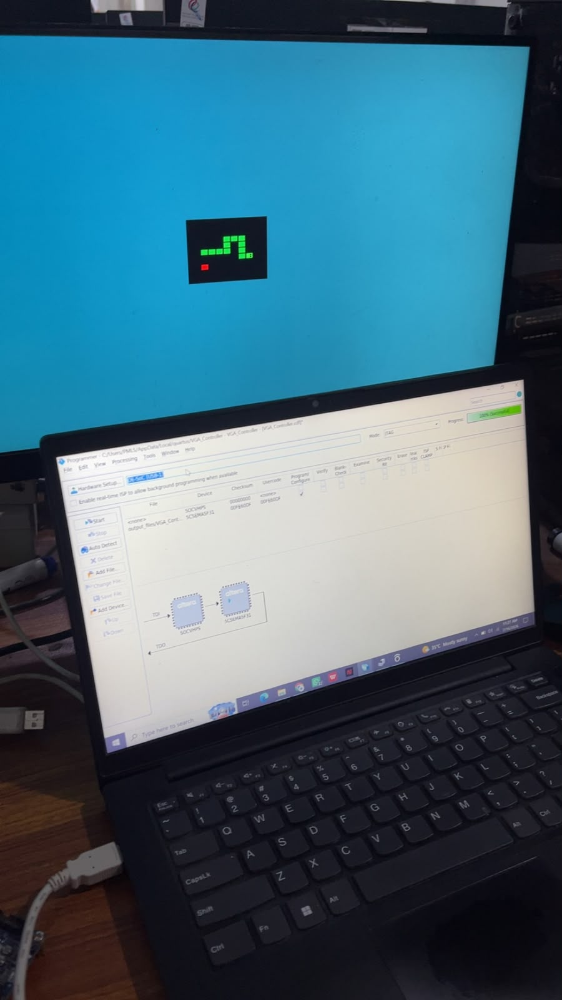

# VGA Controller — DE1-SoC (Cyclone V)

A Verilog-based VGA controller designed and synthesized for the **Terasic DE1-SoC** board (Cyclone V, `5CSEMA5F31C6`). The controller generates standard VGA timing for a **1024×768 @ 60Hz** display and renders a background color with a small on-chip image displayed in the center of the screen.

## Overview

- **Board:** DE1-SoC (Cyclone V SoC, 5CSEMA5F31C6)
- **Language:** Verilog
- **Tool:** Quartus Prime 25.1 (Lite/Standard Edition)
- **Resolution:** 1024×768 @ 60Hz (VESA standard timing)
- **Pixel clock:** 65 MHz (generated from the onboard 50 MHz clock via PLL)
- **Image display:** 128×128 pixel image stored in on-chip memory (ROM), rendered in RGB332 format, centered on a solid background color

## How It Works

1. A **PLL** (`pll65m`) converts the DE1-SoC's onboard 50 MHz clock into a 65 MHz pixel clock, matching the required pixel clock for 1024×768 @ 60Hz.
2. **Horizontal and vertical counters** track the current pixel position on the screen, cycling through the full frame (1344 × 806 clock cycles, including blanking regions).
3. **HSYNC and VSYNC** signals are derived from the counters based on standard VESA front porch / sync pulse / back porch timing (both signals are negative polarity).
4. A **display_enable** signal marks the visible area of the frame (as opposed to the blanking intervals).
5. An **image ROM** (`image_rom`), initialized from `image_data.mif`, stores a 128×128 pixel image (8 bits/pixel, RGB332 format). When the current pixel position falls within the centered image region, the ROM's output pixel is displayed instead of the background color.
6. Because the ROM output is registered (1 clock cycle of latency), the HSYNC, VSYNC, and display_enable signals are pipelined by one cycle to stay aligned with the ROM's delayed pixel data.

## Horizontal Timing (1024×768 @ 60Hz)

| Region | Pixels |
|---|---|
| Visible area | 1024 |
| Front porch | 24 |
| Sync pulse | 136 |
| Back porch | 160 |
| **Total** | **1344** |

## Vertical Timing (1024×768 @ 60Hz)

| Region | Lines |
|---|---|
| Visible area | 768 |
| Front porch | 3 |
| Sync pulse | 6 |
| Back porch | 29 |
| **Total** | **806** |

Pixel clock verification: 1344 × 806 × 60 Hz ≈ 65 MHz.

## File Structure

```
VGA_Controller.qpf        Quartus project file
VGA_Controller.qsf        Pin assignments and project settings
VGA_top.v                 Top-level module (counters, sync generation, RGB output)
pll65m.v                  PLL wrapper (Quartus-generated IP)
pll65m_0002.v             PLL IP core (Quartus-generated)
pll65m_0002.qip           PLL IP settings file
image_rom.v               ROM wrapper (Quartus-generated IP)
image_rom_bb.v            ROM black-box declaration (simulation use)
image_rom.qip             ROM IP settings file
image_data.mif            128x128 image data (RGB332, 16384 bytes)
```

## Pin Assignments (DE1-SoC)

| Signal | Pin |
|---|---|
| CLOCK_50 | PIN_AF14 |
| KEY[0] (reset) | PIN_AA14 |
| LEDR[0] (PLL lock indicator) | PIN_V16 |
| VGA_HS | PIN_B11 |
| VGA_VS | PIN_D11 |
| VGA_CLK | PIN_A11 |
| VGA_BLANK_N | PIN_F10 |
| VGA_SYNC_N | PIN_C10 |
| VGA_R[7:0] | PIN_F13, PIN_E12, PIN_D12, PIN_C12, PIN_B12, PIN_E13, PIN_C13, PIN_A13 |
| VGA_G[7:0] | PIN_E11, PIN_F11, PIN_G12, PIN_G11, PIN_G10, PIN_H12, PIN_J10, PIN_J9 |
| VGA_B[7:0] | PIN_J14, PIN_G15, PIN_F15, PIN_H14, PIN_F14, PIN_H13, PIN_G13, PIN_B13 |

## Building and Programming

1. Open `VGA_Controller.qpf` in Quartus Prime.
2. Run **Processing → Start Compilation**.
3. Connect the DE1-SoC via USB-Blaster and open **Tools → Programmer**.
4. Load the generated `.sof` file and click **Start** to program the FPGA.
5. Connect a VGA monitor to the DE1-SoC's VGA port. The display should show a light blue background with a 128×128 image centered on screen.

## Results

**Successful Quartus compilation:**



**Successful FPGA programming:**



**Output on hardware (DE1-SoC + VGA monitor):**



## Notes

- LEDR[0] indicates PLL lock status.
- KEY[0] acts as an active-low reset for the counters and PLL.
- The design does not use the DE1-SoC's HPS (ARM processor) — it runs entirely in the FPGA fabric.
